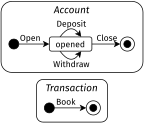
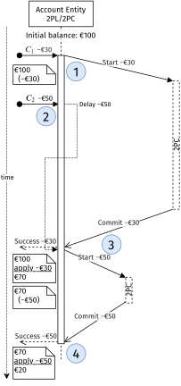
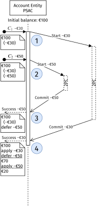



> Blog post about paper: Path-Sensitive Atomic Commit: Local Coordination Avoidance for Distributed Transactions @ https://doi.org/10.22152/programming-journal.org/2021/5/3


I spend a lot of time the last years devising an algorithm that leverages semantically rich models of objects to speed up coordination between objects: Path-Sensitive Atomic Commit or Local Coordination Avoidance. 
In other words: to make transactions faster automatically.
This algorithm can be used to create a more performant synchronization implementation for automatically generated implementations. This enables writing of high-level business logic or functional requirements, and letting the algorithm take care of performance at run time.

Of course this algorithm's performance has to be evaluated.
Does it really perform better than a base-line implementation?

## Background

_Two-Phase Commit (2PC):_
2PC is a well-studied atomic commitment protocol. Atomic Commit requires that multiple resources agree on a action: all should do it or non should do it. This also hold in case of failure of one of the resources.
Resources in this case can be distributed over multiple server nodes, or can even be different applications (see XA).

2PC works with a transaction manager and multiple transaction resources. The manager asks the resources to vote on an action. When it receives a vote commit from all, it tells all to globally commit the decision. If any resource votes to abort, it globally aborts the transaction. 
When a resource votes to commit it promises to durably store and accept a later global commit. This makes sure it continue in case of failure.

The biggest drawback of 2PC is blocking behaviour when the transaction manager crashes between receiving votes and globally committing or aborting. Now the resources are left dangling, because they promised to wait on commit on the manager, and can not continue without it.

_Two-Phase Locking (2PL)_:
2PL is a concurrency control mechanism that uses locking to make sure that no concurrent changes are made to a resource.

### Distributed Transactions

2PL and 2PC can be combined to implement ACID distributed transactions. ACID stand for Atomic, Consistent, Isolated and Durable. These are the default guarantees to expected from (database) transactions.

The locks are on the level of the 2PC resources. When a resource has voted, it is considered locked. Only after handling a global commit or abort it is unlocked again. This makes sure no other transactions can change the data in the mean time.

## Path-sensitive Atomic Commit

### Models in Rebel

Let's first look at an example of such semantically rich models: A bank account system example consisting of money transfers and accounts with balances.
Our model consists of state charts, which can be visually represented:



In the textual representation, we see different classes, with some internal data, representing the account balance and identities. On each of the states events are defined with pre- and postconditions, e.g. `Withdraw` is only valid when the account has enough balance available. 
The `MoneyTransfer` class has a special construct `sync` which represents an atomic synchronized event, where money is `Withdraw`n from one account and `Deposit`ed from another. Either both should happen or none.

```scala
class Account
  accountNumber: Iban @identity
  balance: Money

  initial init   
    on Open(initialDeposit: Money): opened
      pre:  initialDeposit >= €0
      post: this.balance == initialDeposit
      
  opened
    on Withdraw(amount: Money): opened
      pre:  amount > €0, balance - amount >= €0
      post: this.balance == balance - amount
    on Deposit(amount: Money): opened
      pre:  amount > €0
      post: this.balance == balance + amount
    on Close(): closed
    
  final closed

class MoneyTransfer
  initial init
    on Book(amount: Money, to: Account, from: Account): booked
      sync:
        from.Withdraw(amount)
        to.Deposit(amount)
  final booked  
```

We can see how these kinds of models can represent business logic on a relatively high level.

### Rebel with 2PC/2PL

If we want to implement these models in a scalable systems, we can represent all instances of these objects as 2PC resources. This means that can be interacted with separately, until synchronization (using `sync`) is requested. Locally each resource does 2PL, making sure that data is not changed concurrently, and 2PC is used to coordinate the sync.



Above illustration describes what happens for such a resource (Account Entity). Vertically time is represented and the arrow represent messages send and received.

First (1) a vote request is received from a 2PC manager (not shown), preconditions are checked and the resource is locked. When another event (2) arrives it is delayed. Now when the 2PC manager signals the commit later (3), the event's effects are applied to the resource's internal state and the resource is unlocked.
Now the delayed event can start as well. 
We see that in this way all events are nicely serialized for this resource and no preconditions are done on possibly invalid (partial) state.

### PSAC

TBC


